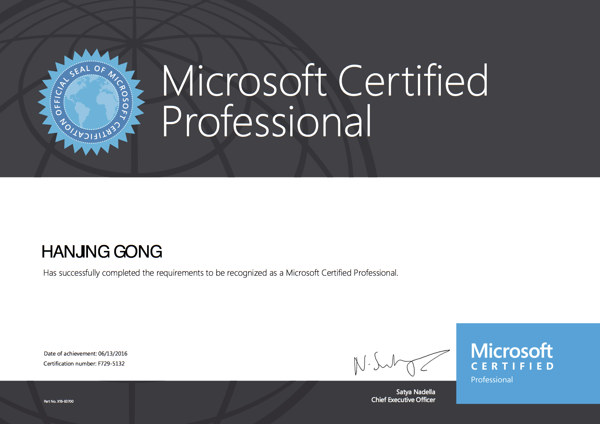

# Richard Gong

##### (C): 0086-18566779714
##### (E): richardgong1987@qq.com
##### Gender: Man
##### Location: Shenzhen,China
##### Github: https://github.com/richardgong1987
##### NPM: https://www.npmjs.com/~richardgong1987
##### Node.js tutorial:  https://www.youtube.com/playlist?list=PLsdWTv8SAAr7_ufM68jgykoOc5WvK97kb
##### MDN MOZILLA: https://developer.mozilla.org/en-US/profiles/richardgong1987

## JOB OBJECTIVE
To pursue a challenging and growth oriented career in a progressive organization and to enhance the level of my technical knowledge and ability to work in-group.

#### TECHNICAL SKILLS:

Programming Languages : Java (proficient), JavaScript (proficient)

Operating Systems : Mac, Linux

RDBMS : MYSQL,Oracle 10g / 11g 

Scripting Language :Linux Shell,JavaScript

Web Technologies : Springboot,Springmvc,Spring,Mybatis,Hibernate,Ionic3.x,Angular5

Web Services : Spring based MicroService and Restful web-services

Framework : SpringCloud, Springboot, Springmvc,Ionic3.x,Angular5, Reactjs

IDE/Tools : Intelij Idea, Datagrip,Webstorm

Web & Application Servers : Tomcat,Jetty,Nginx

Other Tools :Git, SVN, TFS

## PROFILE SUMMARY

Over 5 years of software development experience in design, development, and implementation of diverse applications using Java ecosystem / JEE technologies, Express,Koa,loopback/node.js ecosystem;

Around 3 years of Experience as a User Interface/Front End Developer in developing web applications using typescript/es5/es6,Ionic3.x,HTML5, Angular5 CSS3, jQuery, Angular5;

Expertise in fundamental of JAVA,Javascript,node.js concepts;

Well Developed Verbal and Writing Java web framework,Javascript framework;

Experience in using fundamental concepts of OOP,AOP,IOC,MVC.

Hands-on experience with MicroService and RESTful web services.

Good experience in life cycles of application development & maintenance and production support projects with Agile (Scrum), Test Driven Development (TDD), and Waterfall methodologies.

Ability to adopt and learn new technologies.

Extensive experience right from ideation to delivering a finished product by working closely with multiple teams.

Extensively developed Rich Internet Applications and various UI widgets using jQuery.

Hands on experience in writing the unit test cases Jasmine, and jUnit.

Using version control technologies such as GIT, Source Tree, SVN and CVS for concurrent web development.

Good exposure on working with MySQL, Oracle, SQL and NoSQL databases.

Worked on creating stored procedures using SQL and good knowledge on SSRS and SSIS packages.

Good experience on working with ionic3.x React js ,and angular 5.

## TECHNICAL SKILLS:

##### Programming Languages & Frameworks:

Java, Spring,springboot, Hibernate, Mybatis 
micro services, Criteria, JUnit, typescript,es6/7, JavaScript, ionic3.x, Express,KOA & Node.JS.HTML5, CSS3, jQuery,

#### Tools & Methodologies:

Maven,gradle, SoapUI, Atlassian products such as JIRA, Bamboo, Crucible, Confluence & Bitbucket, 
Heroku, Jenkins, SonarQube, Putty, intelij idea, Agile, TDD, etc. 

#### Servers: 
WebLogic, Tomcat, Nginx & JBoss, jetty.  node.js;

#### Version Controls: 
Git, SVN, TFS;

#### Databases: 

Oracle, MySQL,redis, mangodb.

Operating Systems: Mac, UNIX & Linux.

## WORK EXPERIENCE:

#### 1. Jul 2017 – Feb 2018

Client: Huidian network technology inc. 
Project: Huidian e-commerce Applications
Location: Shenzhen,China
Role: Senior Java Developer
Responsibilities:
Involved in designing, developing and testing the single page web application by using the Spring,SpringMvc,Mybatis, Mysql, Redis,Solr

Led and mentored an array of software developers to understand the requirements from the Features, Stories, and converted those into the code for Universal API of Project.

Developed and deployed an application in production.

Participated in different meetings such as Governance Calls and Ideation Meetings with Application Directors.

Development Managers, Consultants, Team Leads to understand the delivery criticalness, priority, and guide the team accordingly.
 
Actively participated in Sprint Planning, Daily Scrum Calls, Retrospectives, Code Reviews, etc.

Environment:Springboot,Spring,Springmvc, Mybatis,Typescript,Ionic3.x Git, Restful services, intelij Idea, Jenkins, Swagger
 

####  Philippine SurLead LTD. Mar. 2015 – Jun. 2017 

Client: SurLead outsourcing technology inc. 
Project: fh applictions
Location: Manila,the Philippines
Role: Senior Java,Node.js Full stack Developer

Responsibilities:
Unit Tests for system’s robustness.
Enhancements & Maintenance for java web framework
Enhancements & Maintenance for node.js framework
Enhancements & Maintenance for frond end framework.
Design and implement fallback algorithm of departments.
Participate in Database design and analysis;
Design and implement the DISTRIBUTED STORAGE system to store massive information of products, including a large amount of videos and images. Arrange a CLUSTER of servers and determine their functions as web servers, decoding servers or stored servers.
Design and implement user interfaces with HTML5/CSS3, ANGULARJS and make them interact with database; Adopt JQuery EASY UI widgets and other third-party plug-ins.
Design and implement the SEARCH ENGINE for customers; Handle the maintenance afterwards.

Environment:Springboot,Spring , Springmvc, Hibernate,Typescript,Node.js, loopback, Koa,Express,intelij Idea, Git

#### Alibaba.net LTD. Apr 2014 - March 2015

Client: Alibaba.net LTD. 
Project: Alipay applictions
Location: Shanghai,China
Role:Java Full stack Developer

Responsibilities:

Performed code reviews, knowledge sharing, and mentored new joiners to the team.

Developing the Single page Web Applications (SPA) using Spring,springMVC,Hibernate, Backbone.js,zepto.js,jquery.ui.js

Created reusable components (custom directives) to be shared among the application in different places instead of rewriting code again. 
Ex: Accordion, Spinner and Filters etc.

Environment:Spring,Springmvc, Hibernate,JSP, Node.js, Zepto.js,Jquery.js,intelij Idea, Git

 #### Argumturn LTD. March 2010 - March 2014
 
 Client: SAP LTD. 
 Project: SAP Software Outsourcing
 Location: Shanghai,China
 Role:Javascript Developer
 
 Responsibilities:
 
 Experience with jUnit and Jasmine in developing test cases and determining application functionality.
 
 Created business logic to GET, POST, UPDATE and DELETE rest service operations.
 
 Created factory methods to register with modules for the components.
 
 Worked on JAX-RS to develop RESTful web service.
 
 Consumed XML schema and developed the JSON schema and Web services for the data support and structures
    
 Environment: aptana, backbone.js,zepto.js, git

## EDUCATION

##### Shanghai Vocational College of Science and Technology     2007-2010
College degree of Humanities and Social Sciences

#### Wish Education     2010-2011
.Net software engineer

## APPS & SOFTWARE Case

http://www.lead-surf.com/

http://m.ctrip.com/html5/

https://www.alipay.com/

http://www.vlinkage.com/

http://www.gac-toyota.com.cn/

... etc ...

## International Certificate

#### Microsoft Certified Professional

#### Microsoft  Specialist

